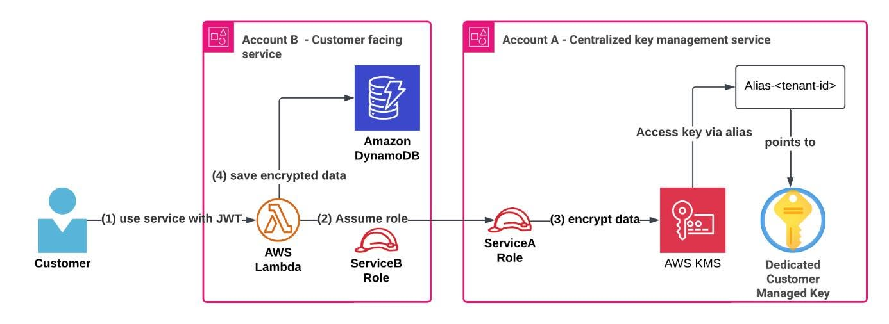

# CÁCH XÂY DỰNG CHIẾN LƯỢC AWS KMS TIẾT KIỆM CHI PHÍ CHO ỨNG DỤNG MULTI-TENANT
Trong quá trình tìm hiểu các kiến trúc AWS dành cho hệ thống SaaS, mình nhận thấy việc mã hóa dữ liệu trong môi trường multi-tenant không chỉ là vấn đề bảo mật, mà còn liên quan trực tiếp đến chi phí và khả năng vận hành lâu dài.
Nếu mỗi tenant hoặc mỗi service đều tạo một KMS key riêng, hệ thống có thể nhanh chóng gặp tình trạng khó quản lý key, tăng chi phí và phức tạp trong quá trình audit. Vì vậy, AWS đề xuất một hướng tiếp cận tối ưu hơn: tập trung hóa việc quản lý key, kết hợp AWS KMS, IAM Role, AWS STS và Alias để vừa đảm bảo bảo mật, vừa kiểm soát chi phí hiệu quả.

### Các điểm chính cần nắm:
* **Tập trung hóa quản lý key ở một account riêng**
  * Các customer managed key của từng tenant được quản lý tập trung trong một account chuyên biệt.
  * Cách này giúp kiểm soát vòng đời của key như tạo, xoay, xóa và audit dễ dàng hơn.
  * Tránh tình trạng key bị phân tán ở nhiều account hoặc nhiều service khác nhau.
* **Sử dụng Alias để định danh key theo từng tenant**
  * Mỗi tenant có thể được gắn một alias riêng, ví dụ: `alias/customer-<tenant-id>`.
  * Service không cần hardcode trực tiếp Key ID.
  * Khi cần thay đổi hoặc xoay key, hệ thống có thể cập nhật alias mà không ảnh hưởng nhiều đến logic ứng dụng.
* **Dùng IAM Role và AWS STS để cấp quyền tạm thời**
  * Service ở account phục vụ khách hàng có thể assume role sang account quản lý key.
  * Quyền truy cập chỉ tồn tại tạm thời và được kiểm soát thông qua IAM Policy.
  * Cách này giúp giảm rủi ro lộ quyền dài hạn và phù hợp với best practice bảo mật trên AWS.
* **Mã hóa dữ liệu trước khi lưu trữ**
  * Dữ liệu nhạy cảm như mật khẩu, API key hoặc thông tin giấy phép có thể được mã hóa trước khi lưu vào DynamoDB hoặc S3.
  * Mỗi tenant sử dụng key riêng, giúp tăng khả năng cô lập dữ liệu.
  * Ngay cả khi nhiều tenant dùng chung một hệ thống lưu trữ, dữ liệu vẫn được bảo vệ theo từng tenant.
* **Dễ mở rộng khi số lượng tenant tăng**
  * Khi có tenant mới, hệ thống chỉ cần tạo thêm key và alias tương ứng.
  * Các service phía customer-facing không cần thay đổi nhiều về code.
  * Kiến trúc này giúp hạn chế tình trạng “key explosion” khi hệ thống phát triển lớn.

### Cách hoạt động trong thực tế:
Luồng xử lý có thể hiểu đơn giản như sau:
1. Khách hàng gửi dữ liệu nhạy cảm vào hệ thống.
2. Service nhận request và đọc thông tin tenant từ JWT.
3. Lambda kiểm tra JWT và xác định tenant ID.
4. Service assume role để truy cập account quản lý key.
5. Hệ thống sử dụng alias `alias/customer-<tenant-id>` để tìm đúng KMS key của tenant.
6. Dữ liệu được mã hóa bằng AWS KMS hoặc AWS Encryption SDK.
7. Dữ liệu sau khi mã hóa được lưu vào Amazon DynamoDB hoặc Amazon S3.

### Vai trò của các dịch vụ AWS:
* **AWS KMS:** Quản lý customer managed key dùng để mã hóa dữ liệu.
* **IAM & AWS STS:** Cấp quyền truy cập tạm thời giữa các account thông qua assume role.
* **AWS Lambda:** Xử lý request, kiểm tra JWT và thực hiện logic mã hóa.
* **Amazon DynamoDB / Amazon S3:** Lưu trữ dữ liệu đã được mã hóa.
* **Alias:** Giúp định danh key theo tenant, tránh hardcode Key ID trong ứng dụng.
* **AWS CloudTrail:** Hỗ trợ audit hoạt động truy cập và sử dụng key.

### Giá trị mang lại:
Chiến lược AWS KMS tập trung mang lại nhiều lợi ích cho hệ thống multi-tenant:
* Giảm chi phí quản lý key khi số lượng tenant tăng.
* Dễ vận hành, dễ audit và dễ kiểm soát vòng đời của key.
* Đảm bảo cô lập dữ liệu giữa các tenant.
* Hạn chế rủi ro cấp quyền quá rộng.
* Giúp hệ thống dễ mở rộng mà không phải thay đổi nhiều ở tầng ứng dụng.
* Phù hợp với các nền tảng SaaS hoặc hệ thống doanh nghiệp xử lý dữ liệu nhạy cảm.

### Kết luận
AWS KMS là một dịch vụ mã hóa mạnh mẽ, nhưng khi áp dụng cho hệ thống multi-tenant, cần có chiến lược thiết kế hợp lý để cân bằng giữa bảo mật, chi phí và khả năng vận hành.
Thông qua mô hình quản lý key tập trung, kết hợp IAM Role, AWS STS và Alias, hệ thống có thể đảm bảo mỗi tenant vẫn có mức độ cô lập dữ liệu riêng, trong khi chi phí và độ phức tạp vận hành được kiểm soát tốt hơn.
Đối với mình, đây là một pattern rất đáng học khi thiết kế các ứng dụng SaaS trên AWS, đặc biệt là những hệ thống cần xử lý dữ liệu nhạy cảm và có khả năng mở rộng trong tương lai.

### Hình ảnh minh họa

### Link bài gốc
<https://aws.amazon.com/vi/blogs/architecture/simplify-multi-tenant-encryption-with-a-cost-conscious-aws-kms-key-strategy/>