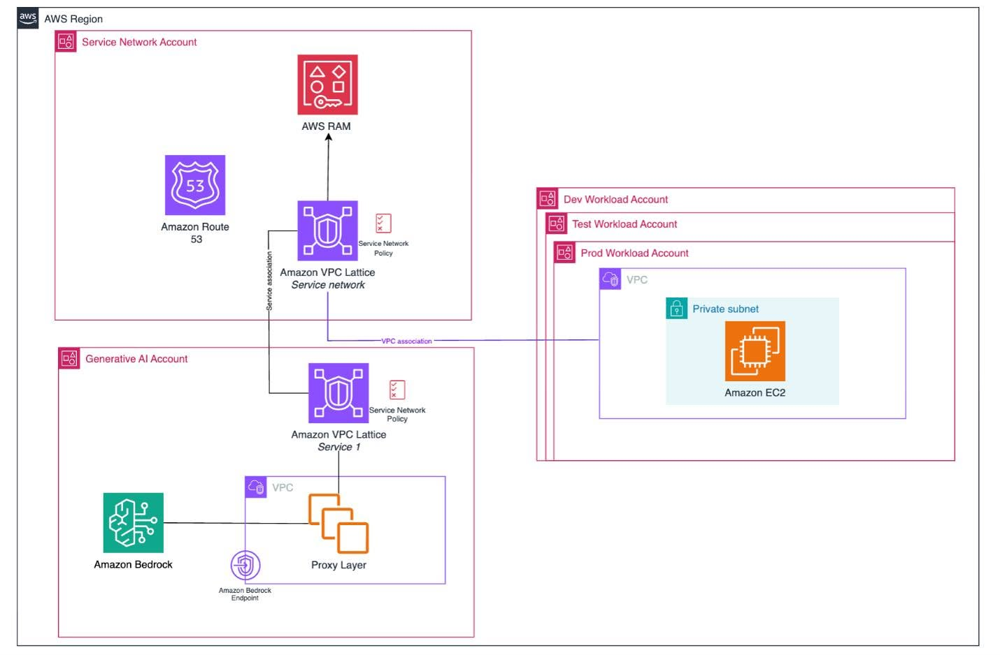

# Amazon Bedrock Baseline Architecture trong AWS Landing Zone: Nền tảng triển khai Generative AI cho doanh nghiệp
Amazon Bedrock Baseline Architecture là một kiến trúc tham chiếu giúp doanh nghiệp triển khai các ứng dụng Generative AI trên AWS theo hướng an toàn, có quản trị và dễ mở rộng.
Khi chỉ xây dựng một vài ứng dụng AI thử nghiệm, các nhóm phát triển có thể kết nối trực tiếp đến Amazon Bedrock. Tuy nhiên, khi số lượng ứng dụng AI tăng lên, doanh nghiệp cần một kiến trúc chuẩn để kiểm soát quyền truy cập, chi phí, bảo mật dữ liệu và khả năng vận hành lâu dài.

### Các điểm chính cần nắm:
* **Cần có kiến trúc chuẩn cho Generative AI**
  * Khi nhiều ứng dụng AI cùng hoạt động, việc quản lý truy cập và chi phí trở nên phức tạp.
  * Doanh nghiệp cần kiểm soát dữ liệu, lưu lượng truy cập và chính sách bảo mật.
  * Kiếm trúc chuẩn giúp việc triển khai AI dễ quản trị và dễ mở rộng hơn.
* **Tách riêng tài khoản theo vai trò**
  * Service Network Account dùng để quản lý kết nối mạng, chính sách truy cập và điều phối lưu lượng.
  * Generative AI Account dùng để triển khai Amazon Bedrock, Foundation Models, Guardrails và các dịch vụ AI liên quan.
  * Workload Accounts dùng để triển khai các ứng dụng nghiệp vụ như chatbot, trợ lý nội bộ, RAG hoặc xử lý tài liệu.
* **Kiểm soát lưu lượng AI bằng VPC Lattice**
  * Các workload không kết nối trực tiếp đến Amazon Bedrock.
  * Lưu lượng AI được điều hướng qua lớp kiểm soát trung tâm.
  * Cách này giúp doanh nghiệp dễ áp dụng chính sách bảo mật và theo dõi hoạt động truy cập.
* **Amazon Bedrock đóng vai trò nền tảng AI dùng chung**
  * Bedrock cung cấp khả năng truy cập các Foundation Models.
  * Doanh nghiệp có thể chuẩn hóa cách các ứng dụng sử dụng dịch vụ AI.
  * Việc quản trị tập trung giúp giảm rủi ro cấu hình sai giữa nhiều nhóm phát triển.
* **Tăng cường bảo mật với Bedrock Guardrails**
  * Guardrails giúp kiểm soát nội dung đầu vào và đầu ra của ứng dụng AI.
  * Hỗ trợ giảm rủi ro khi xử lý dữ liệu nhạy cảm.
  * Phù hợp với các yêu cầu bảo mật và tuân thủ trong môi trường doanh nghiệp.

### Kiến trúc hoạt động tổng quan:
Luồng triển khai có thể hiểu như sau:
1. Ứng dụng trong các workload account cần sử dụng dịch vụ Generative AI.
2. Thay vì gọi trực tiếp Amazon Bedrock, workload truy cập thông qua service network.
3. VPC Lattice đóng vai trò kiểm soát và định tuyến lưu lượng.
4. Generative AI Account quản lý các dịch vụ AI tập trung.
5. Service Network Account hỗ trợ quản lý kết nối, chính sách và chia sẻ dịch vụ giữa nhiều account.
6. AWS RAM có thể được sử dụng để chia sẻ tài nguyên giữa các tài khoản trong tổ chức.

### Vai trò của các dịch vụ AWS:
* **Amazon Bedrock:** Cung cấp nền tảng sử dụng Foundation Models cho ứng dụng Generative AI.
* **Amazon VPC Lattice:** Kết nối và kiểm soát lưu lượng giữa các service trong môi trường multi-account.
* **AWS RAM:** Chia sẻ tài nguyên giữa các AWS Account.
* **Amazon Route 53:** Hỗ trợ phân giải tên miền và định tuyến truy cập dịch vụ.
* **Workload Accounts:** Chạy các ứng dụng AI thực tế như chatbot, RAG hoặc xử lý tài liệu.
* **Service Network Account:** Quản lý lớp mạng dịch vụ và chính sách truy cập tập trung.

### Giá trị mang lại:
Chiến lược Amazon Bedrock Baseline mang lại nhiều lợi ích cho doanh nghiệp:
* Quản lý tập trung nền tảng Generative AI.
* Tăng khả năng kiểm soát bảo mật và truy cập.
* Dễ theo dõi chi phí sử dụng AI giữa nhiều workload.
* Phù hợp với mô hình multi-account trong AWS Landing Zone.
* Hỗ trợ mở rộng từ giai đoạn thử nghiệm đến triển khai thực tế.
* Giúp doanh nghiệp xây dựng AI Platform dùng chung thay vì mỗi nhóm tự triển khai riêng lẻ.

### Kết luận
Amazon Bedrock Baseline Architecture không chỉ là một mô hình kỹ thuật, mà còn là cách tiếp cận giúp doanh nghiệp quản trị Generative AI ở quy mô lớn.
Thông qua việc tách riêng tài khoản AI, kiểm soát lưu lượng bằng VPC Lattice, sử dụng Bedrock như nền tảng AI dùng chung và áp dụng các chính sách bảo mật tập trung, doanh nghiệp có thể triển khai Generative AI một cách an toàn, ổn định và có khả năng mở rộng.
Đối với mình, đây là một kiến trúc rất đáng học vì nó cho thấy khi triển khai AI trong doanh nghiệp, vấn đề không chỉ là gọi được model, mà còn là quản trị, bảo mật, chi phí và khả năng vận hành lâu dài.

### Hình ảnh minh họa

### Link bài gốc
<https://aws.amazon.com/blogs/architecture/amazon-bedrock-baseline-architecture-in-an-aws-landing-zone/>