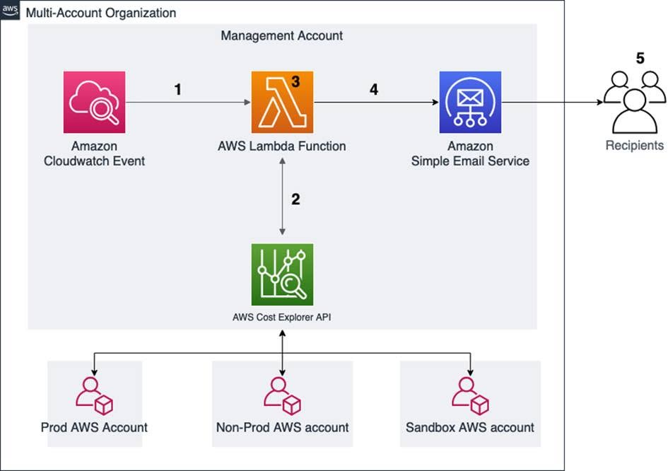

# Gửi báo cáo chi phí delta hàng ngày trong môi trường multi-account bằng AWS Lambda và Cost Explorer

Trong môi trường AWS multi-account, việc theo dõi chi phí là một vấn đề quan trọng nhưng không phải lúc nào cũng dễ thực hiện. Đặc biệt, đội ngũ finance hoặc quản lý thường không có quyền truy cập trực tiếp vào AWS Billing Console, khiến việc chia sẻ thông tin chi phí phải thực hiện thủ công.
Bài viết này giới thiệu một giải pháp tự động gửi báo cáo chi phí delta hằng ngày bằng AWS Lambda, AWS Cost Explorer API, Amazon EventBridge và Amazon Simple Email Service (SES). Đây là một kiến trúc serverless giúp tăng khả năng quan sát chi phí và hỗ trợ quản lý cloud hiệu quả hơn.

### Các điểm chính cần nắm:
* **Bài toán quản lý chi phí trong môi trường multi-account**
  * Doanh nghiệp thường có nhiều AWS account như Production, Non-Production và Sandbox.
  * Thông tin billing thường tập trung ở management account.
  * Không phải thành viên finance hoặc leadership nào cũng có quyền truy cập AWS Billing Console.
  * Việc tổng hợp và gửi báo cáo chi phí thủ công dễ mất thời gian và thiếu kịp thời.
* **Khái niệm delta cost**
  * Delta cost là phần thay đổi chi phí giữa ngày hiện tại và ngày trước đó.
  * Chỉ số này giúp phát hiện nhanh các biến động bất thường.
  * Khi chi phí tăng đột ngột, team có thể kiểm tra nguyên nhân sớm hơn.
  * Đây là cách đơn giản để tăng cost visibility trong tổ chức.
* **Tự động hóa báo cáo bằng Lambda**
  * Lambda được kích hoạt theo lịch hằng ngày.
  * Function gọi AWS Cost Explorer API để lấy dữ liệu chi phí.
  * Dữ liệu được xử lý, tính phần trăm thay đổi và định dạng thành báo cáo HTML.
  * Báo cáo được gửi qua email đến danh sách người nhận.
* **Gửi email bằng Amazon SES**
  * Amazon SES được dùng để gửi báo cáo chi phí đến finance, leadership hoặc các bên liên quan.
  * Người nhận không cần đăng nhập AWS Console để xem tình hình chi phí.
  * Việc gửi tự động giúp giảm thao tác thủ công trong quá trình vận hành.
* **Phù hợp với định hướng FinOps**
  * Giải pháp giúp technical team và finance team cùng theo dõi chi phí dễ hơn.
  * Tăng tính minh bạch trong việc sử dụng tài nguyên cloud.
  * Hỗ trợ phát hiện sớm các account hoặc môi trường có chi phí tăng bất thường.

### Kiến trúc hoạt động tổng quan:
Luồng xử lý có thể hiểu như sau:
1. Amazon EventBridge kích hoạt Lambda theo lịch cron mỗi ngày.
2. AWS Lambda gọi AWS Cost Explorer API để lấy chi phí từ các account trong tổ chức.
3. Lambda tính toán phần chênh lệch chi phí so với ngày trước đó.
4. Lambda định dạng dữ liệu thành báo cáo HTML.
5. Amazon SES gửi báo cáo đến danh sách người nhận.
6. Người nhận có thể theo dõi chi phí hằng ngày mà không cần truy cập Billing Console.

### Vai trò của các dịch vụ AWS:
* **Amazon EventBridge:** Kích hoạt Lambda tự động theo lịch hằng ngày.
* **AWS Lambda:** Xử lý logic lấy dữ liệu chi phí, tính delta và tạo báo cáo.
* **AWS Cost Explorer API:** Cung cấp dữ liệu chi phí và mức sử dụng của các AWS account.
* **Amazon SES:** Gửi báo cáo chi phí qua email.
* **AWS Organizations:** Cho phép quản lý nhiều tài khoản AWS trong cùng một tổ chức.
* **IAM Role:** Cấp quyền cho Lambda truy cập Cost Explorer và gửi email.

### Các bước triển khai chính:
1. Tải CloudFormation template từ bài viết gốc.
2. Cấu hình danh sách AWS account cần theo dõi.
3. Cấu hình danh sách email người nhận.
4. Verify email trong Amazon SES.
5. Deploy CloudFormation stack.
6. Cấp quyền Billing phù hợp cho IAM Role.
7. Cấu hình EventBridge rule với cron expression.
8. Kiểm tra email báo cáo chi phí được gửi tự động.

### Giá trị mang lại:
Giải pháp này mang lại nhiều lợi ích thực tế cho doanh nghiệp:
* Tự động hóa quy trình gửi báo cáo chi phí.
* Giúp finance team và leadership theo dõi chi phí dễ dàng hơn.
* Tăng khả năng cost visibility trong môi trường multi-account.
* Phát hiện sớm biến động chi phí bất thường.
* Giảm thao tác thủ công khi tổng hợp báo cáo.
* Có thể mở rộng để lưu báo cáo vào S3 hoặc xây dựng dashboard phân tích dài hạn.

### Kết luận
Giải pháp gửi báo cáo chi phí delta hằng ngày bằng AWS Lambda và Cost Explorer là một ví dụ thực tế về việc dùng serverless để tự động hóa vận hành cloud.
Điểm mình thấy hay là kiến trúc này khá gọn, sử dụng các dịch vụ managed của AWS như Lambda, EventBridge, Cost Explorer API và SES. Nhờ đó, doanh nghiệp có thể theo dõi chi phí chủ động hơn mà không cần cấp quyền Billing Console cho quá nhiều người.
Đối với mình, đây là một pattern rất đáng học vì nó kết hợp được giữa automation, cost management và FinOps trong môi trường AWS multi-account.

### Hình ảnh minh họa

### Link bài gốc
<https://aws.amazon.com/vi/blogs/architecture/email-delta-cost-usage-report-in-a-multi-account-organization-using-aws-lambda/>