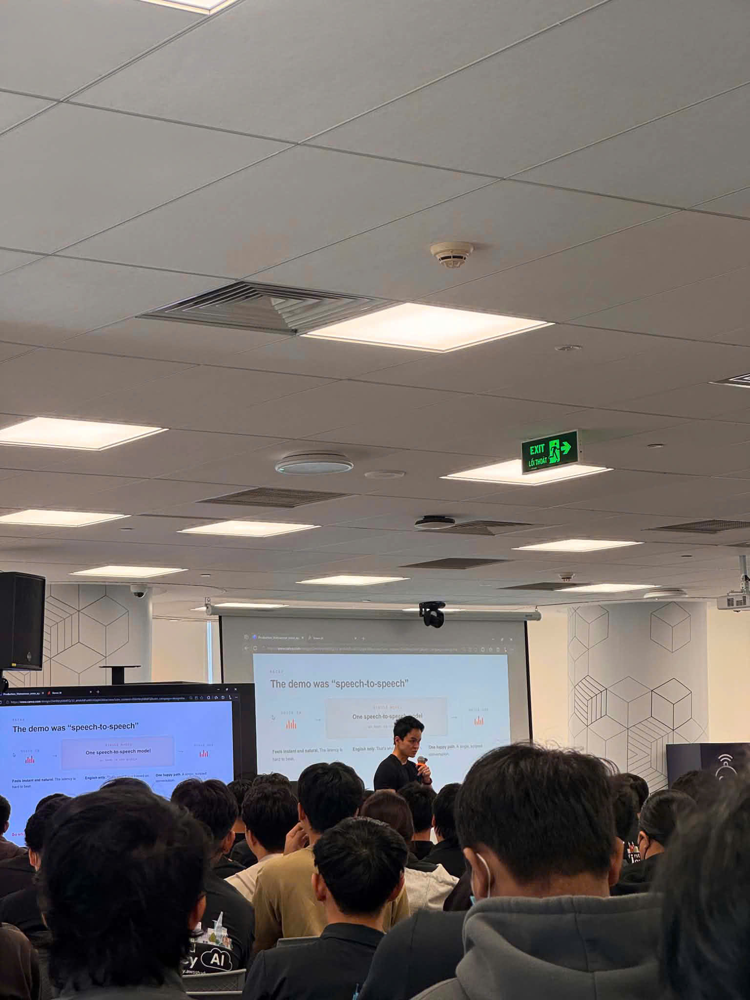

# Bài thu hoạch: "FCAJ Community Day (27 Tháng 6)"
### Mục Đích Của Sự Kiện
Sự kiện FCAJ Community Day (27 Tháng 6) được tổ chức nhằm giới thiệu các dự án công nghệ mới, đặc biệt tập trung vào AI Agents, tự động hóa vận hành, trợ lý giọng nói AI, Amazon Bedrock, Amazon Q và các giải pháp bảo mật kết nối trong môi trường doanh nghiệp.
Các mục tiêu chính của sự kiện gồm:
* Chia sẻ các giải pháp thực tế do các thành viên nghiên cứu và phát triển.
* Giới thiệu xu hướng ứng dụng AI trong vận hành hệ thống, DevOps, chăm sóc khách hàng và hoạch định nhân sự.
* Trình bày cách xây dựng các hệ thống tự động phát hiện, phân tích và xử lý sự cố.
* Làm rõ vai trò của Multi-Agent System, Voice Agent, Amazon Bedrock, Amazon Q và MCP trong các kiến trúc AI hiện đại.
* Cung cấp góc nhìn thực tế về bảo mật dữ liệu khi tích hợp AI vào hệ thống doanh nghiệp.

### Danh Sách Diễn Giả & Đề Tài
* **Steve Trần** - Đề tài: Deep Response Engine: From Detection to Autonomous Resolution
* **Nghĩa Danh - Trung Vũ - Kiệt Trần** - Đề tài: Voice Agents: Building Human-Like AI Conversations at Scale
* **Nguyên Nguyễn - Bảo Phan** - Đề tài: AWS DevOps Agent: Your Always-Available Operations Teammate
* **Trường Trần - Minh Anh** - Đề tài: AI-Powered Productivity: Workforce Planning For Enterprise
* **Toàn Nguyễn - Nghĩa Danh** - Đề tài: Building Secure Private MCP Connection with Amazon Quick

### Nội Dung Nổi Bật Của Các Bài Tham Luận

#### 1. Deep Response Engine: From Detection to Autonomous Resolution - Diễn giả: Steve Trần
Bài trình bày tập trung vào bài toán vận hành hệ thống cloud hiện đại, nơi số lượng cảnh báo ngày càng lớn và độ phức tạp của hệ thống microservices ngày càng cao. Nếu chỉ dựa vào mô hình vận hành truyền thống, đội ngũ kỹ thuật dễ bị quá tải bởi quá nhiều alert.
Diễn giả giới thiệu hướng tiếp cận mới: chuyển từ Alert-driven sang Action-driven. Thay vì chỉ phát hiện và gửi cảnh báo, hệ thống có thể tự phân tích nguyên nhân, đề xuất hướng xử lý và trong một số trường hợp có thể tự thực hiện hành động khắc phục.
Phần demo về Autonomous Incident Response giúp mình hình dung rõ hơn cách một hệ thống có thể tự phát hiện lỗi dịch vụ, kích hoạt quy trình xử lý và phục hồi hoạt động mà không cần can thiệp thủ công quá nhiều.

#### 2. Voice Agents: Building Human-Like AI Conversations at Scale - Diễn giả: Nghĩa Danh - Trung Vũ - Kiệt Trần
Chủ đề này trình bày sự phát triển từ các hệ thống IVR và chatbot truyền thống sang các AI Voice Agents có khả năng hội thoại tự nhiên hơn. Nội dung nhấn mạnh những thách thức khi xây dựng trợ lý giọng nói ở quy mô lớn như độ trễ phản hồi, độ chính xác, khả năng hiểu ngữ cảnh và trải nghiệm người dùng.
Diễn giả giới thiệu cách sử dụng Amazon Bedrock và Amazon Nova Sonic để xây dựng mô hình giao tiếp speech-to-speech. Kiến trúc còn kết hợp các thành phần như telephony, streaming và MCP để tạo ra một luồng hội thoại mượt mà hơn.
Phần demo giúp mình thấy rõ tiềm năng của voice agent trong các lĩnh vực như chăm sóc khách hàng, tổng đài tự động, tư vấn nội bộ và hỗ trợ nghiệp vụ doanh nghiệp.

#### 3. AWS DevOps Agent: Your Always-Available Operations Teammate - Diễn giả: Nguyên Nguyễn - Bảo Phan
Bài chia sẻ giới thiệu mô hình AWS DevOps Agent như một trợ lý vận hành luôn sẵn sàng hỗ trợ đội ngũ kỹ thuật. Thay vì kỹ sư phải tự kiểm tra log, tìm lỗi và xử lý thủ công, agent có thể hỗ trợ phân tích sự cố và đề xuất hành động xử lý.
Nội dung tập trung vào việc giảm hai chỉ số quan trọng trong vận hành hệ thống là MTTD và MTTR. Khi thời gian phát hiện và thời gian khắc phục sự cố được rút ngắn, hệ thống sẽ ổn định hơn và giảm ảnh hưởng đến người dùng cuối.
Diễn giả cũng trình bày cách sử dụng Bedrock AgentCore và cơ chế Multi-agent reasoning để nhiều agent phối hợp xử lý một vấn đề phức tạp. Phần demo trên môi trường Amazon ECS container cho thấy agent có thể hỗ trợ phát hiện lỗi và xử lý sự cố trong hạ tầng container.

#### 4. AI-Powered Productivity: Workforce Planning For Enterprise - Diễn giả: Trường Trần - Minh Anh
Phần trình bày này tập trung vào việc ứng dụng AI trong lĩnh vực nhân sự và hoạch định nguồn lực doanh nghiệp. Trong các tổ chức lớn, việc quản lý nhân sự, phân bổ nguồn lực, xử lý yêu cầu và dự báo nhu cầu lao động là bài toán có độ phức tạp cao.
Diễn giả giới thiệu cách Amazon Q có thể hỗ trợ phân tích dữ liệu nội bộ, giúp bộ phận HR rút ngắn thời gian xử lý công việc và đưa ra quyết định dựa trên dữ liệu.
Nội dung này giúp mình hiểu rằng AI không chỉ được dùng trong kỹ thuật hay chatbot, mà còn có thể hỗ trợ mạnh mẽ cho các bộ phận nghiệp vụ như nhân sự, vận hành và quản trị doanh nghiệp.

#### 5. Building Secure Private MCP Connection with Amazon Quick - Diễn giả: Toàn Nguyễn - Nghĩa Danh
Bài trình bày đề cập đến bài toán bảo mật khi các nền tảng AI cần kết nối với nguồn dữ liệu hoặc các MCP Server. Nếu kết nối đi qua internet công cộng, doanh nghiệp có thể đối mặt với rủi ro rò rỉ dữ liệu hoặc bị truy cập trái phép.
Giải pháp được giới thiệu là thiết lập VPC Private Connectivity để Amazon Quick có thể kết nối đến các MCP Server một cách riêng tư và an toàn hơn. Nội dung này nhấn mạnh tầm quan trọng của việc thiết kế bảo mật ngay từ đầu khi triển khai AI trong môi trường doanh nghiệp.
Qua phần này, mình hiểu rõ hơn vai trò của private connection, network isolation và kiểm soát truy cập khi xây dựng các hệ thống AI có xử lý dữ liệu nhạy cảm.

### Những Gì Học Được

#### Về AI Agents & Generative AI
* Hiểu thêm về cách AI Agent có thể hỗ trợ vận hành hệ thống, phân tích lỗi và tự động hóa hành động xử lý.
* Nắm được khái niệm Multi-agent reasoning, trong đó nhiều agent phối hợp để giải quyết một bài toán phức tạp.
* Biết thêm về hướng phát triển voice agent with Amazon Bedrock và Amazon Nova Sonic.
* Hiểu rằng triển khai AI ở doanh nghiệp không chỉ là tạo chatbot, mà còn phải quan tâm đến bảo mật, dữ liệu, quy trình và khả năng mở rộng.

#### Về Vận Hành & DevOps
* Hiểu sự khác biệt giữa mô hình vận hành dựa trên cảnh báo và mô hình vận hành tự động hành động.
* Nắm được tầm quan trọng của các chỉ số MTTD và MTTR trong đánh giá hiệu quả vận hành.
* Có thêm góc nhìn về cách AI có thể hỗ trợ kỹ sư DevOps trong giám sát và xử lý sự cố.
* Nhận thấy tự động hóa vận hành có thể giúp giảm tải cho đội ngũ kỹ thuật và tăng độ ổn định của hệ thống.

#### Về Bảo Mật Cloud
* Hiểu vai trò của VPC Private Connectivity trong việc bảo vệ luồng dữ liệu nhạy cảm.
* Biết thêm về cách kết nối riêng tư giúp hạn chế rủi ro khi tích hợp AI với nguồn dữ liệu nội bộ.
* Nhận thấy các hệ thống AI trong doanh nghiệp cần được thiết kế theo hướng Security by Design.
* Có thêm kiến thức về cách xây dựng kết nối an toàn giữa AI Assistant Platform và MCP Server.

### Ứng Dụng Vào Công Việc
* **Nghiên cứu AI Agent:** Tìm hiểu thêm cách xây dựng các agent đơn giản để hỗ trợ giám sát log, phát hiện lỗi hoặc gợi ý cách xử lý sự cố.
* **Tự động hóa vận hành:** Áp dụng tư duy Action-driven vào các bài lab hoặc dự án cá nhân, giảm phụ thuộc vào thao tác thủ công.
* **Thiết kế kết nối riêng tư:** Khi xây dựng hệ thống có dữ liệu nhạy cảm, ưu tiên dùng VPC Endpoint hoặc private connectivity thay vì để traffic đi qua internet công cộng.
* **Tìm hiểu Amazon Bedrock:** Tiếp tục nghiên cứu các dịch vụ Generative AI của AWS, đặc biệt là Bedrock Agent, Nova Sonic và các mô hình phục vụ voice interaction.
* **Cải thiện tư duy bảo mật:** Khi tích hợp AI vào hệ thống, cần xem xét quyền truy cập, vị trí dữ liệu, luồng kết nối và cơ chế audit ngay từ giai đoạn thiết kế.

### Trải Nghiệm Trong Event
Sự kiện mang lại cho mình nhiều góc nhìn mới về cách AI đang được đưa vào vận hành thực tế trong doanh nghiệp. Các bài chia sẻ không chỉ nói về AI ở mức ý tưởng, mà còn tập trung vào những vấn đề cụ thể như xử lý sự cố, tối ưu nhân sự, xây dựng voice agent và bảo vệ kết nối dữ liệu.
Điểm mình ấn tượng nhất là các phần live demo. Nhờ có demo, mình dễ hình dung hơn cách AI Agent hoặc hệ thống tự phục hồi có thể hoạt động trong một tình huống thực tế. Các chủ đề cũng được sắp xếp khá hợp lý, đi từ vận hành hệ thống, voice agent, DevOps agent, workforce planning đến bảo mật private connection.
Ngoài kiến thức kỹ thuật, sự kiện còn giúp mình nhận ra rằng AI trong doanh nghiệp cần đi kèm với quản trị, bảo mật và quy trình vận hành rõ ràng. Đây là những yếu tố rất quan trọng nếu muốn triển khai AI ở quy mô lớn.

### Bài Học Rút Ra
1. AI Agent có thể trở thành một phần quan trọng trong vận hành hệ thống hiện đại.
2. Tự động hóa không chỉ giúp tiết kiệm thời gian mà còn giúp giảm lỗi do thao tác thủ công.
3. Khi triển khai AI ở doanh nghiệp, bảo mật và kiểm soát dữ liệu phải được đặt lên hàng đầu.
4. Các chỉ số như MTTD và MTTR rất quan trọng khi đánh giá chất lượng vận hành hệ thống.
5. Private connectivity là lựa chọn cần ưu tiên khi kết nối AI với hệ thống hoặc dữ liệu nội bộ.
6. Generative AI sẽ có giá trị lớn hơn khi được tích hợp vào đúng quy trình nghiệp vụ thực tế.
### Một Số Hình Ảnh Khi Tham Gia Sự Kiện
